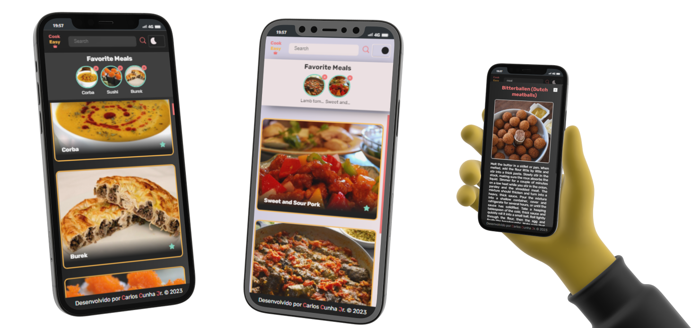

#  [Recipe App](https://carloscunha611.github.io/recipe-app/)

    

> Este é um aplicativo de receitas desenvolvido utilizando as tecnologias JavaScript, CSS e HTML.

## Funcionalidades e descrições

- Site otimizado para acesso em dispositivos móveis, tablets e desktops;
- Funcionalidade de troca de tema entre claro e escuro;
- Receita randômica no início;
- Informações em pop-up;
- Salvamento de receitas favoritas;
- Pesquisa.

    

## ⚙ Tecnologias

- HTML5
- CSS3
- JavaScript
- Git / GitHub
- Biblioteca: [The meals db](https://www.themealdb.com/)

## 🔗 Portfólio e links

  
  

